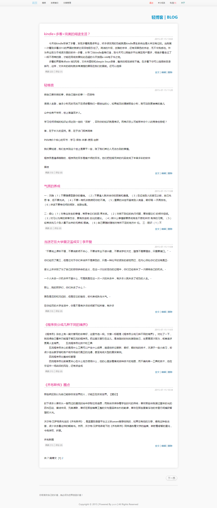

# PHP-Blog
PHP | HTML5 | CSS3 Blog

## Require

- PHP
- Nginx or Apache
- Mysql

## Get Started

* Import the SQL file `install/qingblog.sql`.
* Modify the Mysql Config `common/conn.php`
* Visit the http:localhost/`yourPath`

## Actual effect：

